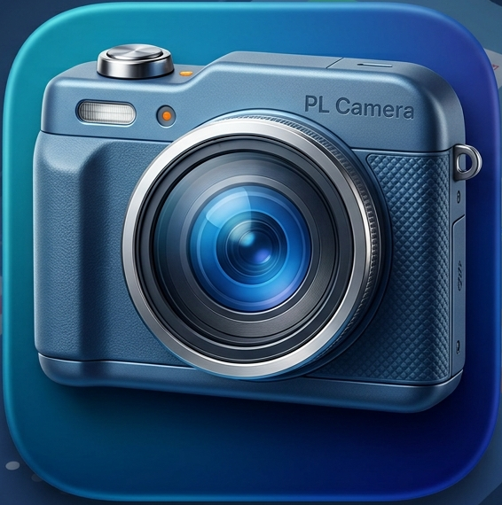
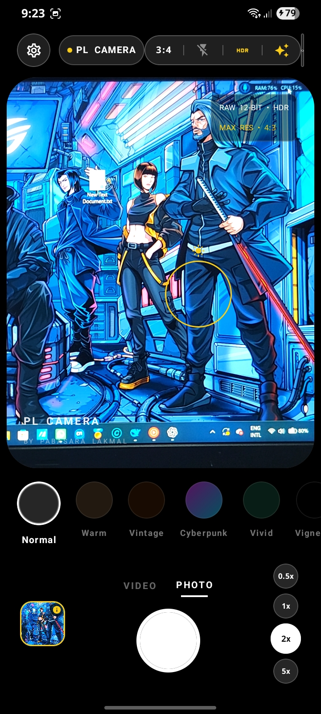
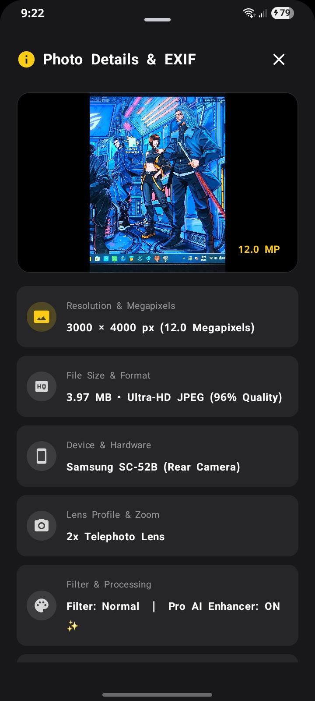
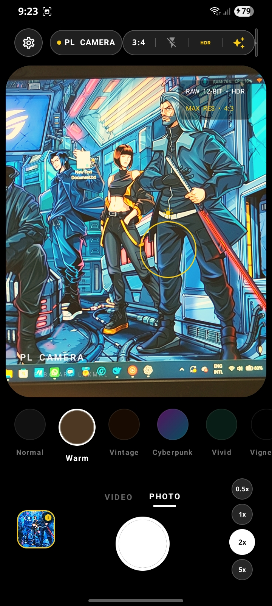

# 📸 PL Camera - Capture Life, Your Way

<p align="center">
  
</p>

<p align="center">
  <b>A modern, high-performance Android Camera application built with Jetpack Compose & CameraX.</b><br/>
  <sub>Created with ❤️ by <b>Pabasara Lakmal</b></sub>
</p>

<p align="center">
  <a href="https://kotlinlang.org/"></a>
  <a href="https://developer.android.com/jetpack/compose"></a>
  <a href="https://developer.android.com/training/camerax"></a>
  <a href="https://m3.material.io/"></a>
  
</p>

---

## 📱 App Screenshots

| Main Camera Interface | Photo Details & EXIF Inspector | Pro AI & Live Filters |
| :---: | :---: | :---: |
|  |  |  |

---

## ✨ Features

- 📸 **High-Resolution Photo Capture**: Ultra-HD JPEG captures saved cleanly to `Pictures/PLCamera/` via Android MediaStore API.
- 🎥 **1080p Full HD Video Recording**: Real-time video recording with audio capture saved directly to `Movies/PLCamera/`.
- 📊 **Photo Details & EXIF Inspector**:
  - Instantly tap the bottom gallery thumbnail after taking a shot to inspect full metadata.
  - Displays **Megapixels** (e.g. `12.0 MP`), **Width × Height**, **File Size**, **Device Model & Hardware**, **Lens Used**, **Aspect Ratio**, **Flash/HDR State**, **Timestamp**, and **File Path**.
- 🎨 **10 Pro Live Color Filters**: Real-time canvas matrix filter transformations:
  - *Normal, Vivid, Cinematic, Cyberpunk, Golden Hour, Black & White, Sepia, Emerald, Vignette, and Drama*.
- ✨ **Pro AI Color Enhancer**: Smart real-time clarity, contrast, and dynamic tone curve optimization for every photo.
- 🔭 **Multi-Lens Zoom Switcher**: Direct zoom preset toggles (`0.5x Ultra-Wide`, `1x Wide Main`, `2x Telephoto`, `5x Super Zoom`) + smooth pinch-to-zoom gestures.
- 🎯 **Tap-to-Focus & Exposure Control**: Interactive focus point positioning with glowing focus ring animation.
- ⚡ **Advanced Camera Controls**:
  - Aspect Ratio Toggle (`4:3`, `16:9`, `1:1`).
  - Flash Mode Control (`Off`, `On`, `Auto`, `Torch`).
  - Timer Delay (`Off`, `3s`, `10s`).
  - Framing Grid (`Off`, `3x3 Rule of Thirds`, `4x4 Grid`).
- 🔊 **Custom Feedback**: Shutter haptics and toggleable shutter sound effects.
- 🚀 **Branded Splash Loading Screen**: Elegant dark neon startup screen with animated loading progress indicator.

---

## 🛠️ Tech Stack & Architecture

- **Language**: [Kotlin](https://kotlinlang.org/) (100%)
- **UI Framework**: [Jetpack Compose](https://developer.android.com/jetpack/compose) with Material 3 components
- **Camera Core**: [Android Jetpack CameraX](https://developer.android.com/training/camerax) (`camera-core`, `camera-camera2`, `camera-lifecycle`, `camera-view`, `camera-video`)
- **Asynchronous Execution**: Kotlin Coroutines & Flow
- **Media Storage**: Android `MediaStore` API with scoped storage compliance
- **Architecture**: Modern Android MVVM architecture with clean state management

---

## 📥 How to Download & Install

### System Requirements

- **Device**: Android Phone or Tablet
- **Minimum OS**: Android 8.0 (Oreo / API Level 26) or higher
- **Recommended OS**: Android 12, 13, 14, or 15

### Installation Steps

1. **Download the APK**:
   - Go to the **[GitHub Releases](../../releases)** section of this repository.
   - Download the latest **`PL-Camera.apk`** (or `app-release.apk`) directly to your Android device.

2. **Allow Installation from Unknown Sources**:
   - When prompted after opening the `.apk` file, tap **Settings** and enable **"Allow from this source"** for your browser or file manager.

3. **Install & Open**:
   - Tap **Install** and launch **PL Camera**.
   - Grant the required permissions (**Camera** and **Microphone**) when prompted to enjoy full camera and video recording capabilities!

---

## 🔒 Permissions Used

| Permission | Purpose |
| :--- | :--- |
| `android.permission.CAMERA` | Required for live preview, photos, and video capture |
| `android.permission.RECORD_AUDIO` | Required for recording audio in video mode |
| `android.permission.WRITE_EXTERNAL_STORAGE` | Storage access on older Android versions (API < 29) |
| `android.permission.VIBRATE` | Tactile shutter haptic feedback |

---

## 📄 License & Terms of Use

```
Copyright (c) 2026 Pabasara Lakmal. All Rights Reserved.

This application is provided strictly for personal installation, evaluation,
and testing purposes.

UNAUTHORIZED COPYING, REPRODUCTION, REDISTRIBUTION, MODIFICATION, OR
COMMERCIAL USE OF THIS APPLICATION, ITS SOURCE CODE, OR ASSOCIATED BINARIES,
IN WHOLE OR IN PART, IS STRICTLY PROHIBITED WITHOUT PRIOR WRITTEN PERMISSION
FROM PABASARA LAKMAL.
```

---

<p align="center">
  Designed & Developed with ❤️ by <b>Pabasara Lakmal</b>
</p>
